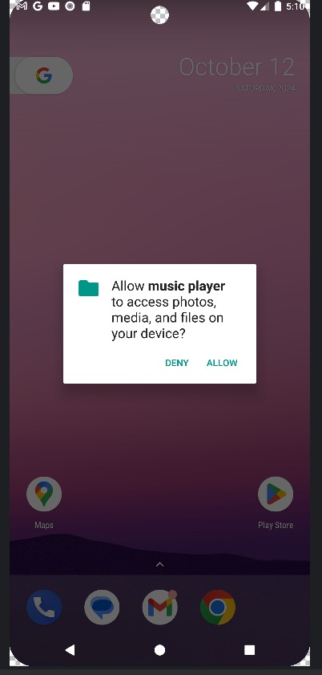
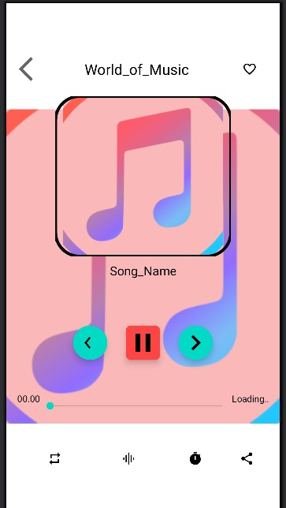
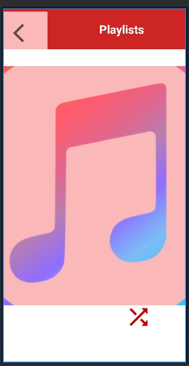

# 🎵 Music Player (Sangeet)

Sangeet is a modern, fast and beautifully crafted Android music player built with Kotlin. 
It automatically scans your device for audio files and presents them in a clean, intuitive and responsive interface. 
With features like smart playlists, favourites, shuffle, repeat modes and notification-based media controls, the app ensures complete control over your music. 
Designed to be lightweight yet powerful, Sangeet delivers a smooth, reliable and enjoyable offline listening experience.

---

## 📸 Screenshots

Screenshots are displayed in **equal-sized cards** for clean look.

<table>
  <tr>
    <td></td>
    <td></td>
    <td></td>
  </tr>
  <tr>
    <td></td>
    <td></td>
    <td></td>
  </tr>
  <tr>
    <td></td>
    <td></td>
    <td></td>
  </tr>
  <tr>
    <td></td>
    <td></td>
  </tr>
</table>

---

## 📝 Description

Music Player (Sangeet) is a clean, fast and modern offline music player app built completely in Kotlin.  
It automatically scans all audio files from your device and organizes them into a beautiful list with album art, song details and smooth transitions.

The app provides essential music features such as play/pause, next/previous, seek controls, shuffle, repeat and background playback through Android’s MediaPlayer API.  
You also get playlist creation, favourites management, and a fully functional notification player with media controls — allowing you to control music even when the app is minimized.

With a simple UI, smooth animations and lightweight performance, Sangeet delivers a complete offline music experience without ads or unnecessary permissions.

### ✨Features (Premium Version)

Automatically scans & lists all local audio files

Smooth playback controls: Play / Pause / Next / Previous

Integrated notification bar media controls

Shuffle, Repeat One, and Repeat All modes

Create and manage Playlists & Favourites easily

Clean, modern and responsive UI with smooth animations

Fast performance with lightweight Kotlin architecture

Background playback support with seamless transitions

## How to run

1. Clone repo:
   `git clone https://github.com/ankit-yadav1234/Music-player.git`
2. Open in Android Studio → let Gradle sync
3. Run on emulator or device (Enable USB debugging)
4. Grant storage/media permissions when asked

## Developer

**Developed by:** Ankit Yadav  
**Email:** ankitybarahi@gmail.com  
**GitHub:** https://github.com/ankit-yadav1234/Music-player  
**LinkedIn:** https://www.linkedin.com/in/ankit-yadav-4b1b25266/

@ | Out-File -Encoding utf8 README.md
