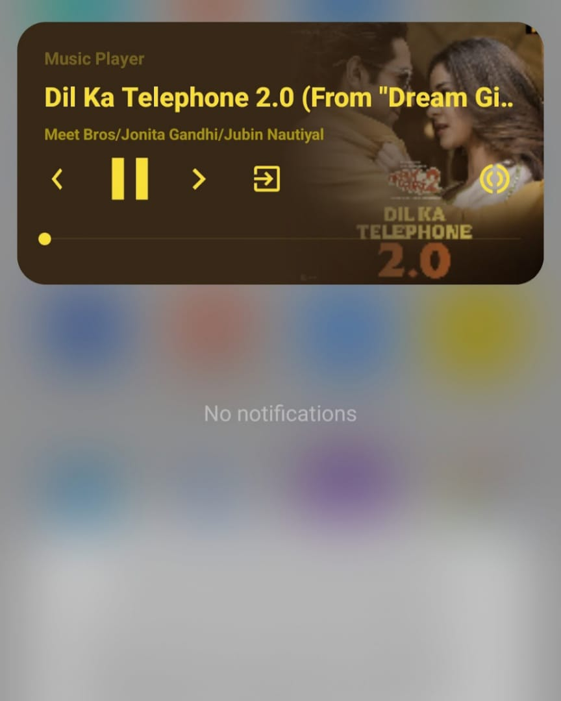
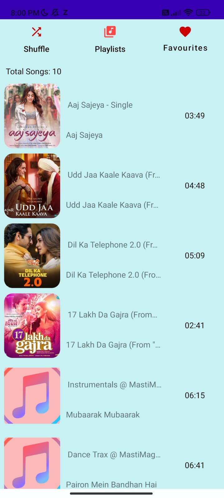
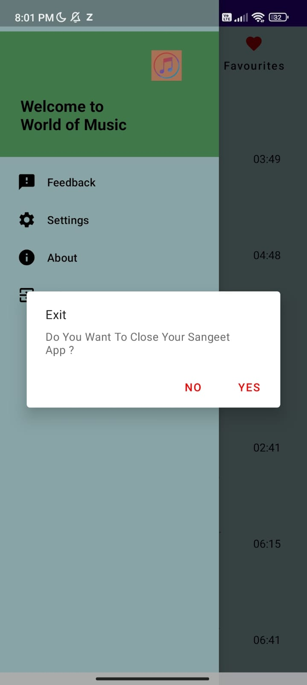
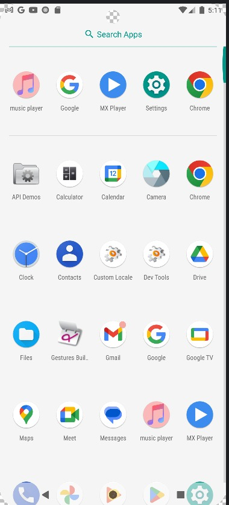
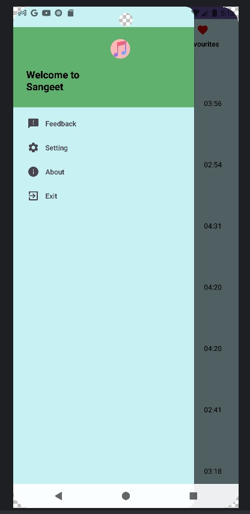
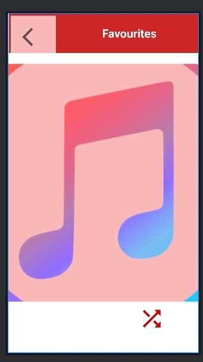

# Music-player

@'

# 🎵 Music Player (Sangeet)

A lightweight Android music player app with playlist, favourites, notification controls and more.

## 📸 Screenshots (Carousel-style)

## Short description

Music Player (Sangeet) is an Android app built in Kotlin. Features:

- Scan & list local audio files
- Play / Pause / Next / Previous
- Notification media controls
- Shuffle / Repeat
- Playlists & Favourites

## How to run

1. Clone repo:
   `git clone https://github.com/ankit-yadav1234/Music-player.git`
2. Open in Android Studio → let Gradle sync
3. Run on emulator or device (Enable USB debugging)
4. Grant storage/media permissions when asked

## Developer

**Developed by:** Ankit Yadav  
**Email:** ankitybarahi@gmail.com  
**GitHub:** https://github.com/ankit-yadav1234/Music-player  
**LinkedIn:** https://www.linkedin.com/in/ankit-yadav-4b1b25266/

'@ | Out-File -Encoding utf8 README.md
